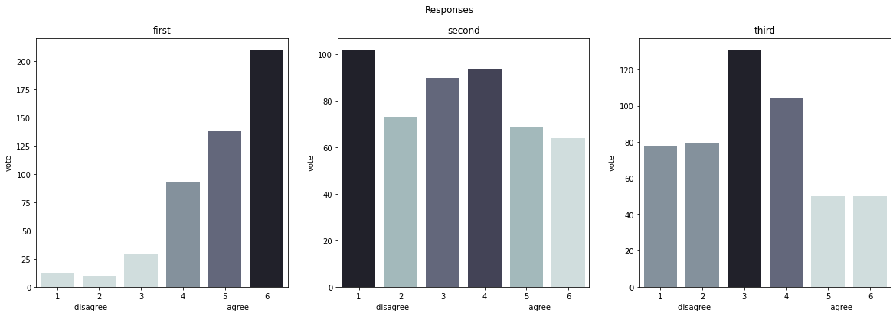

This project aims to **study the opinion of the population** of Grand Nancy (France) on a few specific questions. The objective was to collect people's opinions without favoring a particular social category. 
We can **predict people opinion** with different precisions: 
*   **High**: [1 - 6] : approval graduation.
*   **Medium**: 
    *   [1 - 2] : People tend to disagree.
    *   [3 - 4] : People are mixed.
    *   [5 - 6] : People tend to agree.
*   **Low**: 
    *   [1 - 3] : People generally disagree.
    *   [4 - 6] : People generally agree.

