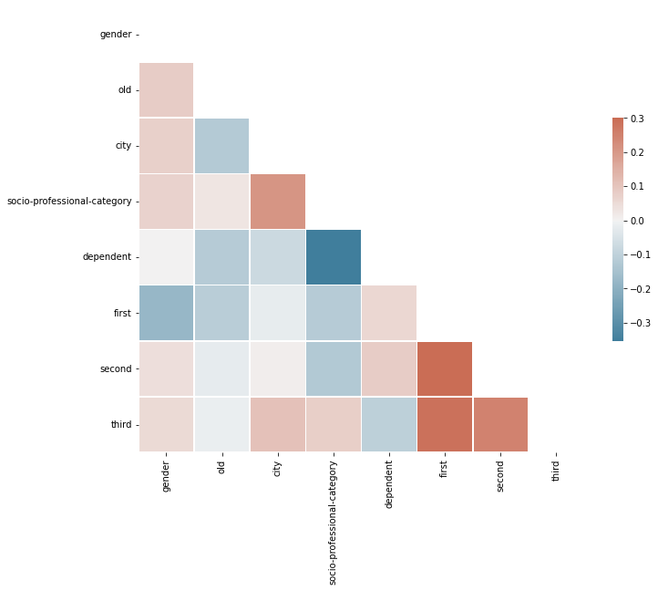

This project aims to **study the opinion of the population** of Grand Nancy (France) on a few specific questions. We wants to collect people's opinions without favoring a particular social category. 
People can answer questions on a scale of 1 to 6. The objective is to study the **correlations** between their **characteristics and their responses**.

493 people responded to the survey.

People features: 
*  First name,
*  gender,
*  age,
*  city,
*  socio-professional-category,
*  dependent.

Correlation Matrix :

Predicting if people are **agree to make Grand Nancy much greener** (First question).

*   **to_drop**: Time, Name and First.
*   **target**: First.
*   **all targets**: First, second and third.
*   **test_size**: 10%.

| Classifier  | Score          |
| :--------------- |:---------------:|
| knn  |   0.46        |
| svc  | 0.48             |
| baggingclassifier  | 0.44          |
| adaboostclassifier  | 0.20          |
| gradientboostingclassifier  | 0.54          |

As you can see, the results are quite low. To overcome this problem, we decided to make the answers of each person less precise in order to **reduce the risk of error** in the model.
In this way, an elected official of the town hall could choose a compromise between the precision of the answers and that of the model.

We can **predict people opinion** with different precisions: 
*   **High**: 
    *   [1 - 6] : approval graduation.
*   **Medium**: 
    *   [1 - 2] : People tend to disagree.
    *   [3 - 4] : People are mixed.
    *   [5 - 6] : People tend to agree.
*   **Low**: 
    *   [1 - 3] : People generally disagree.
    *   [4 - 6] : People generally agree.

Predicting if people are **agree to make Grand Nancy much greener** (First question).

*   **to_drop**: Time, Name and First.
*   **target**: First.
*   **all targets**: First, second and third.
*   **test_size**: 10%.
*   **precision**: Medium.

| Classifier  | Score          |
| :--------------- |:---------------:|
| knn  |   0.72        |
| svc  | 0.70             |
| baggingclassifier  | 0.74          |
| adaboostclassifier  | 0.78          |
| gradientboostingclassifier  | 0.76          |

Predicting if people are **agree to make Grand Nancy much greener** (First question).

*   **to_drop**: Time, Name and First.
*   **target**: First.
*   **all targets**: First, second and third.
*   **test_size**: 10%.
*   **precision**: Low.

| Classifier  | Score          |
| :--------------- |:---------------:|
| knn  |   0.96        |
| svc  | 1.00             |
| baggingclassifier  | 0.98          |
| adaboostclassifier  | 0.96          |
| gradientboostingclassifier  | 1.00          |

